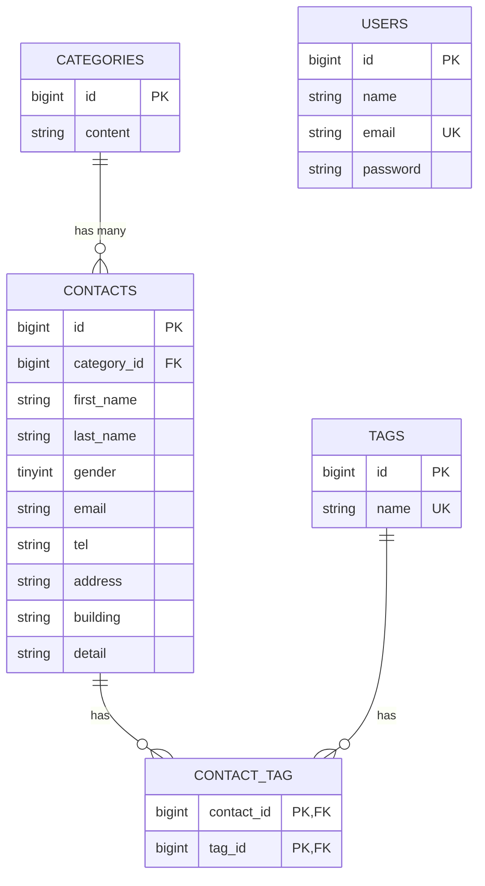

# COACHTECH お問い合わせフォーム

## 概要

一般ユーザー向けのお問い合わせフォームと、管理者向けのお問い合わせ管理機能を備えたWebアプリケーションです。

一般ユーザーは、お問い合わせ内容とタグを入力し、確認画面を経て送信できます。

認証済みユーザーは管理画面で、以下の操作を行えます。

* お問い合わせの一覧表示
* 名前・メールアドレス・性別・カテゴリー・日付による検索
* 検索条件を反映したお問い合わせデータのCSVエクスポート
* お問い合わせ詳細の確認
* お問い合わせの削除
* タグの登録・編集・更新・削除

また、認証不要の公開APIを通して、お問い合わせの一覧取得・詳細取得・新規作成・更新・削除をJSON形式で行えます。

## ER図



* 1つのカテゴリーには、複数のお問い合わせが紐づきます。
* 1つのお問い合わせは、1つのカテゴリーに属します。
* お問い合わせとタグは、`contact_tag`中間テーブルを介した多対多の関係です。
* `users`テーブルは管理画面へのログイン認証に使用します。

## 環境構築

本プロジェクトは、Docker DesktopとLaravel Sailを使用して動作します。

この手順は、完成済みのリポジトリをクローンし、開発環境を再現するためのものです。Laravelプロジェクトの新規作成や、Sail・Tailwind CSSの再インストールは必要ありません。

### 前提条件

以下を使用できる状態にしてください。

* Git
* Docker Desktop
* WSL2（Windowsの場合）

Docker Desktopを起動してから、WSLのターミナルで以降のコマンドを実行します。

### 1. リポジトリをクローン

```bash
git clone https://github.com/akiko-11/contact-form-app.git
cd contact-form-app
```

### 2. 環境設定ファイルを作成

```bash
cp .env.example .env
```

`.env`を開き、データベースの接続情報が以下の設定になっていることを確認します。

```env
APP_URL=http://localhost

DB_CONNECTION=mysql
DB_HOST=mysql
DB_PORT=3306
DB_DATABASE=laravel
DB_USERNAME=sail
DB_PASSWORD=password
```

`DB_HOST`には、`localhost`や`127.0.0.1`ではなく、DockerのMySQLサービス名である`mysql`を指定します。

### 3. Composer依存パッケージをインストール

ローカル環境でComposerを使用できる場合は、次を実行します。

```bash
composer install
```

Composerを使用できない場合は、Dockerを利用してインストールします。

```bash
docker run --rm \
    -u "$(id -u):$(id -g)" \
    -v "$(pwd):/var/www/html" \
    -w /var/www/html \
    -e COMPOSER_CACHE_DIR=/tmp/composer_cache \
    laravelsail/php82-composer:latest \
    composer install
```

### 4. Laravel Sailを起動

```bash
./vendor/bin/sail up -d
```

コンテナの状態を確認します。

```bash
./vendor/bin/sail ps
```

以下のサービスが起動していることを確認してください。

* `laravel.test`
* `mysql`
* `phpmyadmin`

### 5. アプリケーションキーを生成

```bash
./vendor/bin/sail artisan key:generate
```

### 6. マイグレーションと初期データを実行

```bash
./vendor/bin/sail artisan migrate --seed
```

既存のテーブルを削除し、初期状態から作り直す場合は次を実行します。

```bash
./vendor/bin/sail artisan migrate:fresh --seed
```

> `migrate:fresh`を実行すると、データベース内の既存データはすべて削除されます。

### 7. フロントエンドの依存パッケージをインストール

Sailが起動している状態で実行します。

```bash
./vendor/bin/sail npm install
```

Tailwind CSS、Alpine.jsなど、プロジェクトで必要なパッケージは`package.json`に定義されているため、個別の再インストールは必要ありません。

### 8. Vite開発サーバーを起動

```bash
./vendor/bin/sail npm run dev
```

画面を確認している間は、このコマンドを実行したままにしてください。

Viteを停止する場合は、実行中のターミナルで`Ctrl + C`を押します。

### 9. アプリケーションへアクセス

ブラウザで以下へアクセスします。

| 画面         | URL                         |
| ---------- | --------------------------- |
| お問い合わせフォーム | `http://localhost`          |
| ユーザー登録     | `http://localhost/register` |
| ログイン       | `http://localhost/login`    |
| 管理画面       | `http://localhost/admin`    |
| phpMyAdmin | `http://localhost:8080`     |

管理画面を使用する場合は、`http://localhost/register`からユーザーを登録し、ログインしてください。

### 10. Sailエイリアスを設定（任意）

毎回`./vendor/bin/sail`と入力せず、`sail`だけでコマンドを実行したい場合に設定します。

bashの場合：

```bash
echo "alias sail='[ -f sail ] && bash sail || bash vendor/bin/sail'" >> ~/.bashrc
source ~/.bashrc
```

zshの場合：

```bash
echo "alias sail='[ -f sail ] && bash sail || bash vendor/bin/sail'" >> ~/.zshrc
source ~/.zshrc
```

設定後は、次のように実行できます。

```bash
sail artisan migrate --seed
sail npm run dev
```

### 11. コンテナを停止

```bash
./vendor/bin/sail down
```

### Apple Silicon搭載Macについて

Apple Silicon搭載Macで、Sail起動時に次のエラーが発生する場合があります。

```text
no matching manifest for linux/arm64/v8
```

その場合は、`compose.yaml`のMySQLサービスへ次の設定が必要になることがあります。

```yaml
platform: 'linux/amd64'
```

## 使用技術

| 技術           | バージョン・用途      |
| ------------ | ------------- |
| HTML         | 画面構造          |
| CSS          | スタイル設定        |
| PHP          | 8.5.7         |
| Laravel      | 10.50.2       |
| MySQL        | 8.4.10        |
| Vite         | 5.4.21 / フロントエンド開発環境 |
| Tailwind CSS | 3.4.19        |
| Alpine.js    | 3.15.12 / フロントエンド処理 |
| Docker       | コンテナ環境        |
| Laravel Sail | Docker開発環境の操作 |
| phpMyAdmin   | データベース管理      |
| Postman      | 公開APIの動作確認     |

## エンドポイント一覧

### お問い合わせ

| メソッド | パス                  | 概要               |
| ---- | ------------------- | ---------------- |
| GET  | `/`                 | お問い合わせ入力画面を表示    |
| POST | `/contacts/confirm` | 入力内容を検証し、確認画面を表示 |
| POST | `/contacts`         | お問い合わせと選択したタグを登録 |
| GET  | `/thanks`           | サンクスページを表示       |

### 認証

| メソッド | パス          | 概要          |
| ---- | ----------- | ----------- |
| GET  | `/register` | ユーザー登録画面を表示 |
| POST | `/register` | ユーザーを登録     |
| GET  | `/login`    | ログイン画面を表示   |
| POST | `/login`    | ログイン処理      |
| POST | `/logout`   | ログアウト処理     |

### 管理画面

以下のエンドポイントは、認証済みユーザーのみアクセスできます。

| メソッド   | パス                          | 概要               |
| ------ | --------------------------- | ---------------- |
| GET    | `/admin`                    | お問い合わせ一覧・検索画面を表示 |
| GET    | `/contacts/export`            | 検索条件を反映したお問い合わせCSVを出力 |
| GET    | `/admin/contacts/{contact}` | お問い合わせ詳細を表示      |
| DELETE | `/admin/contacts/{contact}` | お問い合わせを削除        |
| POST   | `/admin/tags`               | タグを登録            |
| GET    | `/admin/tags/{tag}/edit`    | タグ編集画面を表示        |
| PUT    | `/admin/tags/{tag}`         | タグ名を更新           |
| DELETE | `/admin/tags/{tag}`         | タグを削除            |

## APIエンドポイント一覧

以下の公開APIは認証不要で利用できます。

| メソッド | パス                         | 概要                                     | 認証 |
| -------- | ---------------------------- | ---------------------------------------- | ---- |
| GET      | `/api/v1/contacts`           | お問い合わせ一覧を取得・検索・ページネーション | 不要 |
| GET      | `/api/v1/contacts/{contact}` | お問い合わせ詳細を取得                   | 不要 |
| POST     | `/api/v1/contacts`           | お問い合わせを新規作成                   | 不要 |
| PUT      | `/api/v1/contacts/{contact}` | お問い合わせを更新                       | 不要 |
| DELETE   | `/api/v1/contacts/{contact}` | お問い合わせを削除                       | 不要 |

## テスト

テストには、SQLiteのインメモリデータベースを使用します。

### 全テストを実行

```bash
./vendor/bin/sail artisan test
```

### Unit Testのみ実行

```bash
./vendor/bin/sail artisan test --testsuite=Unit
```

### Feature Testのみ実行

```bash
./vendor/bin/sail artisan test --testsuite=Feature
```

### カバレッジを含む全テストを実行

```bash
./vendor/bin/sail artisan test --coverage
```

### テスト結果

```text
Tests: 2 deprecated, 71 passed (373 assertions)
Coverage: 80.1%
```

PHP 8.5による既知の非推奨警告がありますが、すべてのテストとアサーションは正常に完了しています。

## 日本語化

バリデーションメッセージの日本語化には、各FormRequestの`messages()`と、認証機能用の`lang/ja`を使用しています。

本プロジェクトでは、`laravel-lang/*`系の外部翻訳パッケージは使用していません。

## 開発環境URL

| 画面         | URL                         |
| ---------- | --------------------------- |
| お問い合わせフォーム | `http://localhost`          |
| ユーザー登録     | `http://localhost/register` |
| ログイン       | `http://localhost/login`    |
| 管理画面       | `http://localhost/admin`    |
| phpMyAdmin | `http://localhost:8080`     |

## 作成者

渡利明子
